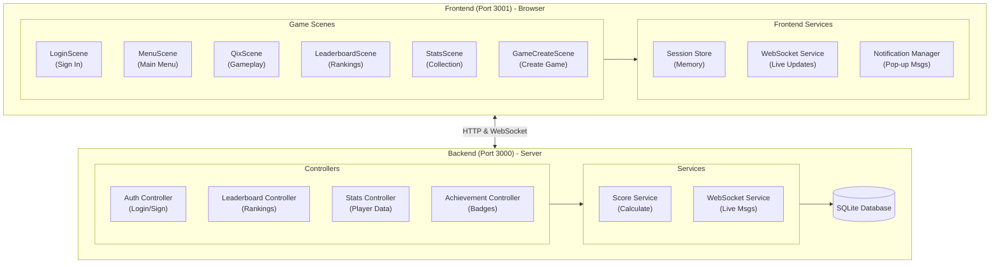
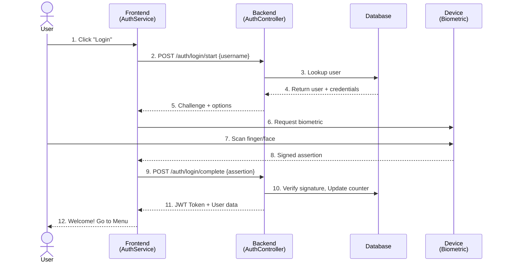
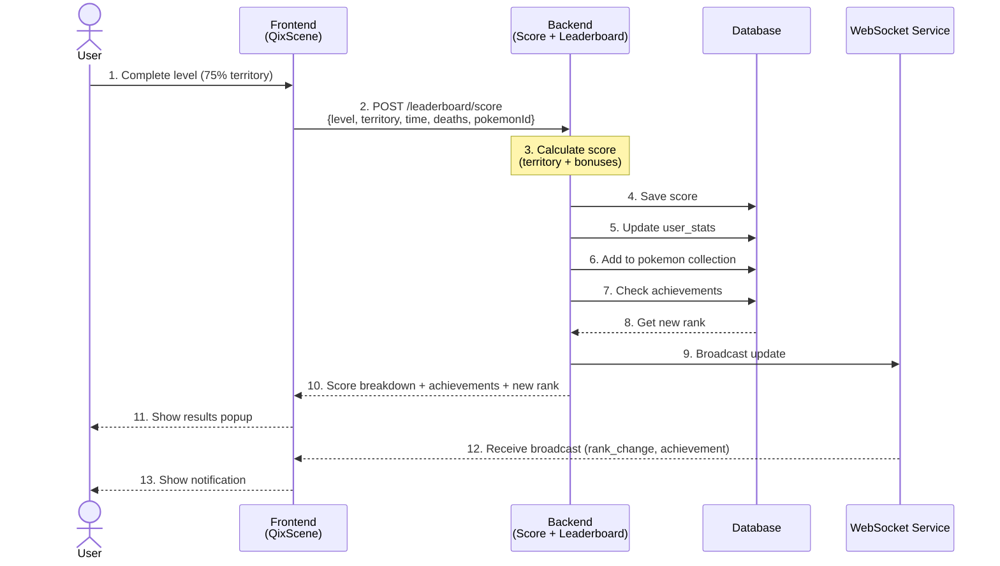
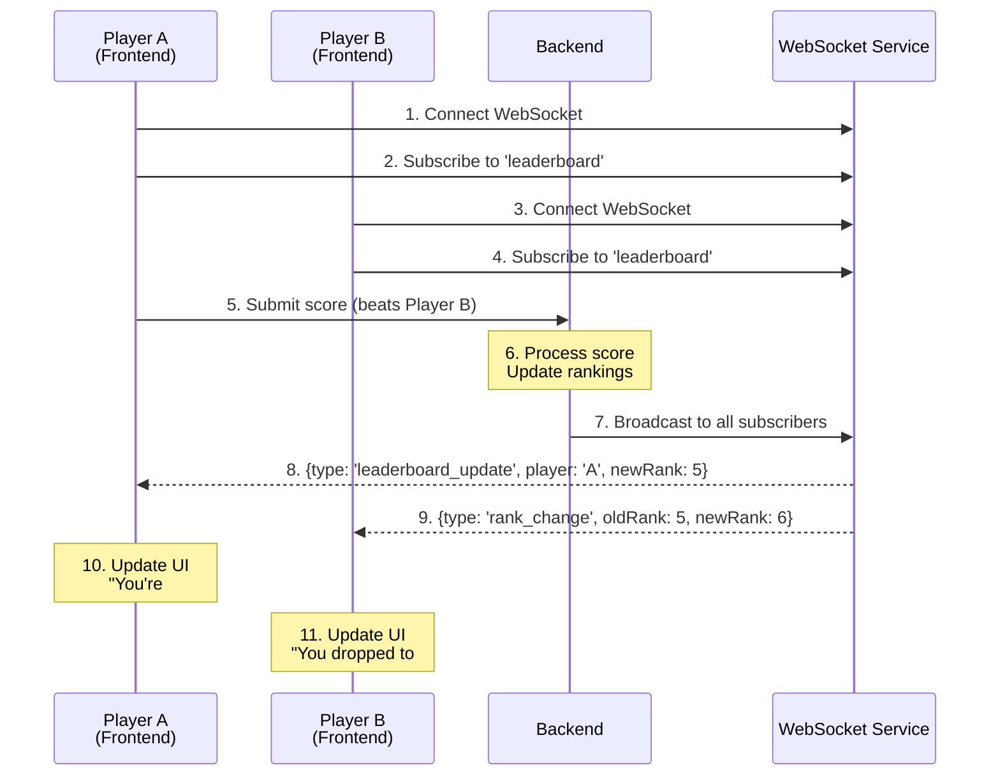
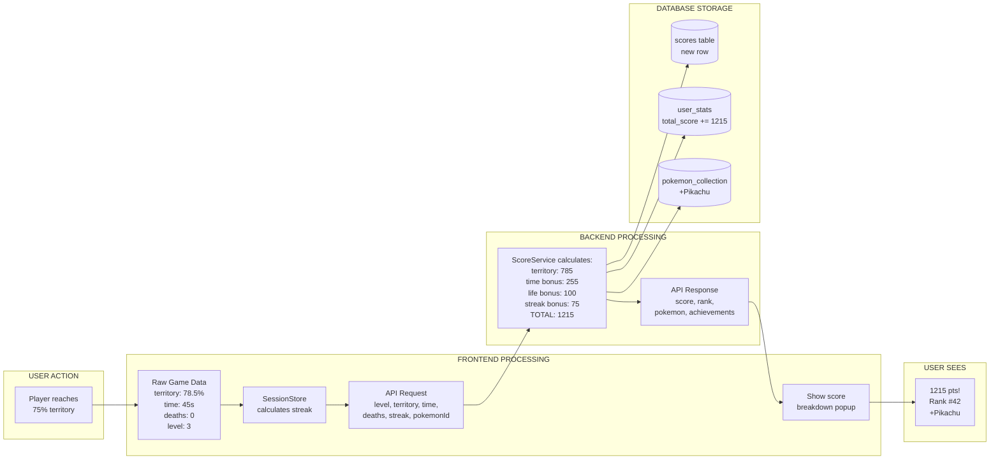
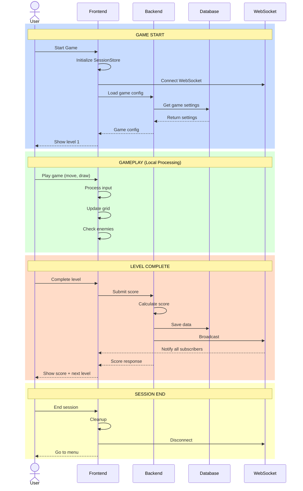
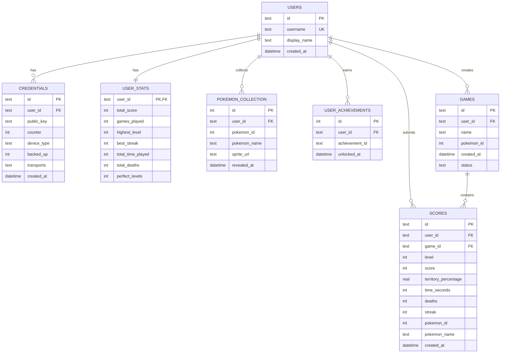

# Peekachoo Game Architecture

A Qix-style territory capture game with Pokemon theming, featuring passkey authentication, real-time leaderboards, and achievement systems.

> **What is this document?**
> This document explains how the Peekachoo game works "under the hood." It's written for anyone who wants to understand the game's technical design, even if you don't have programming experience.

---

## Glossary of Terms

Before diving in, here are some common terms explained in simple language:

| Term | Simple Explanation |
|------|-------------------|
| **Frontend** | The part of the game you see and interact with (the game screen, buttons, animations). Think of it as the "face" of the application. |
| **Backend** | The behind-the-scenes part that stores data and handles game logic. Think of it as the "brain" that remembers your scores and manages everything. |
| **API** | A way for the frontend and backend to talk to each other. Like a waiter taking your order (request) to the kitchen (backend) and bringing back food (response). |
| **Database** | A structured way to store information permanently, like a filing cabinet for all player accounts, scores, and achievements. |
| **WebSocket** | A live connection between your game and the server that allows instant updates (like seeing someone's score change in real-time). |
| **Authentication** | The process of proving who you are (logging in). |
| **Passkey** | A modern, password-free way to log in using your device's fingerprint, face recognition, or security key. |
| **JWT (Token)** | A digital "pass" that proves you're logged in, like a wristband at an event. |
| **Port** | A numbered "door" on a computer where a program listens for connections. Different programs use different ports to avoid conflicts. |

---

## Table of Contents

1. [System Overview](#system-overview)
2. [Tech Stack](#tech-stack)
3. [Authentication Flow](#authentication-flow)
4. [Game Logic](#game-logic)
5. [Score & Session System](#score--session-system)
6. [Leaderboard System](#leaderboard-system)
7. [Achievement System](#achievement-system)
8. [WebSocket Integration](#websocket-integration)
9. [Database Schema](#database-schema)
10. [API Endpoints](#api-endpoints)

---

## System Overview

> **In Simple Terms:**
> The game has two main parts: the **Frontend** (what you play in your browser) and the **Backend** (a server that stores all the data). They communicate over the internet using HTTP requests and WebSockets.



### How They Work Together

1. **You open the game** → Your browser loads the Frontend
2. **You log in** → Frontend asks Backend to verify your identity
3. **You play the game** → Frontend handles gameplay locally
4. **You complete a level** → Frontend sends your score to Backend
5. **Backend calculates** → Processes score, checks achievements, updates leaderboard
6. **You see updates** → Backend sends results back, Frontend displays them

---

## Tech Stack

> **In Simple Terms:**
> "Tech Stack" refers to all the technologies (programming languages, tools, frameworks) used to build the game. Here's what each one does:

### Frontend (The Game You See)

| Technology | What It Does |
|------------|--------------|
| **Phaser 3.10** | A game engine - software that handles graphics, animations, physics, and user input. Think of it as the "game maker toolkit." |
| **TypeScript** | A programming language (improved version of JavaScript) that helps catch errors before the game runs. |
| **Webpack** | A tool that bundles all the code files into one file that browsers can understand. Like packing a suitcase. |
| **BrowserSync** | A development tool that automatically refreshes your browser when code changes. Runs on Port 3001. |
| **NES.css** | A style library that makes everything look like old Nintendo games (retro/pixel art style). |

### Backend (The Server)

| Technology | What It Does |
|------------|--------------|
| **Node.js** | Allows JavaScript to run on a server (not just in browsers). The foundation of the backend. |
| **Express.js** | A framework that makes it easy to create web servers and handle requests. Like a receptionist routing calls. |
| **SQLite** | A lightweight database that stores all data in a single file. Good for smaller applications. |
| **SimpleWebAuthn** | A library that handles passkey authentication (fingerprint/face login). |
| **ws** | A library for WebSocket connections (real-time communication). |
| **JWT** | Creates secure tokens that prove a user is logged in. |

---

## Frontend-Backend Integration

> **In Simple Terms:**
> This section shows how the game you see (Frontend) communicates with the server (Backend). Think of it like a restaurant: the Frontend is the waiter taking your order, and the Backend is the kitchen preparing your food.

### Component Communication Diagram

> **What is this?**
> This diagram shows which parts of the Frontend talk to which parts of the Backend, like a map of phone lines between departments.

```mermaid
flowchart TB
    subgraph Frontend["FRONTEND (Browser - Port 3001)"]
        subgraph Scenes["Game Scenes"]
            LS[LoginScene]
            MS[MenuScene]
            QS[QixScene]
        end

        subgraph FServices["Frontend Services"]
            AS[AuthService]
            GS[GameService]
            SS[StatsService]
            LBS[LeaderboardService]
            WSS[WebSocketService]
        end

        Scenes --> FServices
    end

    subgraph Network["HTTP & WebSocket (Port 3000)"]
        API[REST API]
        WS[WebSocket]
    end

    subgraph Backend["BACKEND (Server - Port 3000)"]
        subgraph Routes["Express Routes"]
            R1[/api/auth/*]
            R2[/api/games/*]
            R3[/api/stats/*]
            R4[/api/leaderboard/*]
        end

        subgraph Controllers["Controllers"]
            AC[Auth Controller]
            GC[Game Controller]
            SC[Stats Controller]
            LC[Leaderboard Controller]
        end

        subgraph BServices["Services"]
            ScS[Score Service]
            AcS[Achievement Service]
            WSvc[WebSocket Service]
        end

        Routes --> Controllers
        Controllers --> BServices
        BServices --> DB[(SQLite Database)]
    end

    AS -->|POST| R1
    GS -->|GET/POST| R2
    SS -->|GET| R3
    LBS -->|GET/POST| R4
    WSS <-->|WebSocket| WSvc
```

---

### API Integration Matrix

> **What is this?**
> A quick reference table showing which Frontend service calls which Backend endpoint.

| Frontend Service | API Endpoint | HTTP Method | Backend Controller | Purpose |
|------------------|--------------|-------------|-------------------|---------|
| **AuthService** | `/api/auth/register/start` | POST | AuthController | Begin passkey registration |
| | `/api/auth/register/complete` | POST | AuthController | Complete registration |
| | `/api/auth/login/start` | POST | AuthController | Begin passkey login |
| | `/api/auth/login/complete` | POST | AuthController | Complete login, get JWT |
| | `/api/auth/me` | GET | AuthController | Get current user info |
| **GameService** | `/api/games` | GET | GameController | List available games |
| | `/api/games` | POST | GameController | Create new game |
| | `/api/games/:id` | GET | GameController | Get game details |
| | `/api/games/:id` | PUT | GameController | Update game |
| **StatsService** | `/api/stats` | GET | StatsController | Get player statistics |
| | `/api/stats/history` | GET | StatsController | Get game history |
| | `/api/stats/collection` | GET | StatsController | Get Pokemon collection |
| **LeaderboardService** | `/api/leaderboard` | GET | LeaderboardController | Get rankings |
| | `/api/leaderboard/around-me` | GET | LeaderboardController | Get nearby rankings |
| | `/api/leaderboard/score` | POST | LeaderboardController | Submit score |
| **WebSocketService** | `ws://server:3000` | WebSocket | WebSocketService | Real-time updates |

---

### Sequence Diagrams

> **What are Sequence Diagrams?**
> They show the step-by-step flow of messages between different parts of the system over time. Read from top to bottom.

#### 1. User Login Flow



#### 2. Score Submission Flow



#### 3. Real-Time Leaderboard Updates



---

### Data Flow Diagram

> **What is this?**
> Shows how data transforms as it moves through the system, from user action to database storage.



---

### Swimlane Diagram: Game Session Lifecycle

> **What is this?**
> A swimlane diagram separates actions by who/what performs them, showing responsibilities clearly.



---

## Authentication Flow

> **In Simple Terms:**
> Authentication is how the game knows who you are. Instead of passwords, this game uses **Passkeys** - a modern method where your device (phone, laptop) proves your identity using fingerprint, face scan, or a security key.

### Why Passkeys Instead of Passwords?

- **More Secure**: Can't be guessed or stolen like passwords
- **Easier**: No need to remember complex passwords
- **Phishing-Proof**: Only works on the real website, not fake copies

### How Registration Works (First Time Sign Up)

```
   Your Device              Game Server           Your Phone/Computer
   (Browser)                (Backend)             Security Feature
       │                        │                        │
       │  Step 1: "I want to    │                        │
       │  register as 'Ash'"    │                        │
       │───────────────────────>│                        │
       │                        │                        │
       │  Step 2: "OK, here's   │                        │
       │  a challenge to prove  │                        │
       │  you own this device"  │                        │
       │<───────────────────────│                        │
       │                        │                        │
       │  Step 3: Browser asks  │                        │
       │  for fingerprint/face  │                        │
       │────────────────────────────────────────────────>│
       │                        │                        │
       │  Step 4: Device creates│                        │
       │  a unique digital key  │                        │
       │<────────────────────────────────────────────────│
       │                        │                        │
       │  Step 5: Send the key  │                        │
       │  to server for storage │                        │
       │───────────────────────>│                        │
       │                        │                        │
       │  Step 6: "Success!     │                        │
       │  Here's your login     │                        │
       │  token (JWT)"          │                        │
       │<───────────────────────│                        │
       └────────────────────────┴────────────────────────┘
```

### How Login Works (Returning Player)

The process is similar, but instead of creating a new key, your device proves it has the key that was registered before.

---

## Game Logic

> **In Simple Terms:**
> This section explains how the actual game works - the rules, how you win/lose, and how levels progress.

### Scene Flow (Game Screens)

Think of "Scenes" as different screens in the game:

```
┌──────────────┐      ┌──────────────┐      ┌──────────────────────┐
│ Login Scene  │ ───> │  Menu Scene  │ ───> │ Qix Scene (Gameplay) │
│ (Sign In)    │      │ (Main Menu)  │      │ (Actually Playing)   │
└──────────────┘      └──────┬───────┘      └──────────────────────┘
                             │
                             ├───> Leaderboard Scene (Rankings)
                             │
                             ├───> Stats Scene (Your Collection)
                             │
                             └───> Game Create Scene (Make New Game)
```

### Qix Gameplay Mechanics

> **What is Qix?**
> Qix (pronounced "kicks") is a classic arcade game from 1981. You claim territory by drawing lines while avoiding enemies.

#### The Playing Field

```
┌────────────────────────────────────────┐
│ ░░░░░░░░░░░░░░░░░░░░░░░░░░░░░░░░░░░░░░ │  ░ = Unclaimed territory
│ ░░░░░░░░░░░░░░░░░░░░░░░░░░░░░░░░░░░░░░ │      (gray area)
│ ░░░░░░░░░░░░ QIX ░░░░░░░░░░░░░░░░░░░░░ │
│ ░░░░░░░░░░░░  ◇  ░░░░░░░░░░░░░░░░░░░░░ │  ◇ = Qix enemy
│ ░░░░░░░░░░░░░░░░░░░░░░░░░░░░░░░░░░░░░░ │      (bounces around)
│ ░░░░░░░░░░░░░░░░░░░░░░░░░░░░░░░░░░░░░░ │
│ ░░░░░░░░░░░░░░░░░░░░░░░░░░░░░░░░░░░░░░ │
│▓▓▓▓▓▓▓▓▓▓▓▓▓▓▓▓▓▓▓▓▓▓▓▓▓▓▓▓▓▓▓▓▓▓▓▓▓▓▓▓│  ▓ = Claimed territory
│▓▓▓▓▓▓▓▓▓▓▓▓▓▓▓▓▓▓▓▓▓▓▓▓▓▓▓▓▓▓▓▓▓▓▓▓▓▓▓▓│      (reveals Pokemon)
│▓▓▓▓▓▓▓▓▓▓▓▓▓▓▓▓▓▓▓▓▓▓▓▓▓▓▓▓▓▓▓▓▓▓▓▓▓▓▓▓│
├────────────────────────────────────────┤
│ ●────────SPARKY────────●               │  ● = Sparky enemy
│ (patrols the border)                   │      (moves along edges)
└────────────────────────────────────────┘
        ▲
        │
        YOU (Player marker)
```

#### Core Concepts Explained

| Element | What It Is | What It Does |
|---------|------------|--------------|
| **Grid** | The rectangular playing field | Where all the action happens |
| **Player** | Your character (small marker) | Moves along borders and draws lines into unclaimed territory |
| **Sparkies** | Enemy that looks like a spark | Patrols along the borders - touches you = death |
| **Qix** | Bouncing enemy in the center | Moves randomly in unclaimed area - touches your line = death |
| **Territory** | Percentage of grid you've claimed | Your goal is to claim enough to win |

#### How to Play

1. **Move along the border** (safe zone)
2. **Venture into unclaimed territory** to draw a line
3. **Complete your line** by reaching another border
4. **The smaller area gets claimed** as your territory
5. **Avoid enemies** while drawing!

#### Win Condition
- Claim **75% or more** of the territory
- This reveals the hidden Pokemon image
- Answer a quiz question about that Pokemon to proceed

#### Loss Conditions
- Sparky touches you while you're on the border
- Qix touches your line while you're drawing

### Level Progression

Each level gets harder:

| Level | Territory Target | Sparkies | Qix Enemies | Speed |
|-------|-----------------|----------|-------------|-------|
| 1 | 60% | 1 | 1 | Slow |
| 2 | 65% | 1 | 1 | Medium |
| 3 | 70% | 2 | 1 | Medium |
| 4+ | 75%+ | 2+ | 2+ | Fast |

### Pokemon Reveal System

```
┌─────────────────────────────────────────────────────────────┐
│  1. Complete Level    2. Pokemon Revealed   3. Quiz Time!   │
│                                                              │
│  ┌──────────────┐     ┌──────────────┐     ┌──────────────┐ │
│  │ ▓▓▓▓▓▓▓▓▓▓▓▓ │     │              │     │ What type is │ │
│  │ ▓▓▓▓▓▓▓▓▓▓▓▓ │     │   PIKACHU!   │     │  Pikachu?    │ │
│  │ ▓▓▓ 78% ▓▓▓▓ │ ──> │     ⚡🐭      │ ──> │              │ │
│  │ ▓▓▓▓▓▓▓▓▓▓▓▓ │     │              │     │ A) Electric  │ │
│  │ ▓▓▓▓▓▓▓▓▓▓▓▓ │     │              │     │ B) Fire      │ │
│  └──────────────┘     └──────────────┘     └──────────────┘ │
│                                                              │
│  4. Correct Answer = Score Saved + Next Level!               │
│     Wrong Answer = Try Again (unlimited attempts)            │
└─────────────────────────────────────────────────────────────┘
```

---

## Score & Session System

> **In Simple Terms:**
> A "session" is one play-through of the game. The system tracks everything you do during that session and calculates your score at the end.

### What is a Session?

Think of it like this:
- You start the game → **Session begins**
- You play level 1, 2, 3... → **Session tracks your progress**
- You quit or lose all lives → **Session ends, final score calculated**

### Session Lifecycle

```
┌─────────────────────────────────────────────────────────────┐
│                    Your Gaming Session                       │
│                                                              │
│  START ──> Play Level 1 ──> Complete ──> Play Level 2 ──>   │
│    │            │              │              │               │
│    │        (You might        Score         (Continue        │
│    │         die here)       Saved!         playing)         │
│    │            │                                             │
│    │            ▼                                             │
│    │      Death Recorded                                      │
│    │      (but you respawn)                                   │
│    │                                                          │
│    └────────────────────> SESSION ENDS ──> Final Score       │
│                           (quit or game over)                 │
└─────────────────────────────────────────────────────────────┘
```

### How Your Score is Calculated

Your final score is made up of several parts:

| Component | How It's Calculated | Example |
|-----------|--------------------| --------|
| **Territory Score** | % claimed × 10 × level bonus | 80% × 10 × 1.2 = 960 points |
| **Time Bonus** | 300 minus seconds taken (faster = more) | Finished in 45 sec = 255 bonus |
| **Life Bonus** | +100 if you didn't die | No deaths = +100 |
| **Quiz Bonus** | +50 if correct on first try | First try correct = +50 |
| **Streak Bonus** | Number of levels in a row × 25 | 3 level streak = +75 |

**Example Total Score:**
```
Territory:  960 points
Time Bonus: 255 points
Life Bonus: 100 points
Quiz Bonus:  50 points
Streak:      75 points
─────────────────────
TOTAL:    1,440 points
```

### Score Submission (What Happens Behind the Scenes)

```
   Your Game                                  Server
   (Frontend)                                (Backend)
       │                                         │
       │  "I finished level 3!"                  │
       │  Sends: level, territory %, time,       │
       │         deaths, pokemon ID              │
       │────────────────────────────────────────>│
       │                                         │
       │                              Calculates your score
       │                              Checks for achievements
       │                              Updates leaderboard
       │                              Records the Pokemon
       │                                         │
       │  Receives: score breakdown,             │
       │  new rank, any achievements earned      │
       │<────────────────────────────────────────│
       │                                         │
       │  Shows you the results!                 │
       └─────────────────────────────────────────┘
```

---

## Leaderboard System

> **In Simple Terms:**
> The leaderboard shows how your scores compare to other players. It's like a high score table at an arcade.

### Types of Leaderboards

| Type | What It Shows |
|------|---------------|
| **All Time** | Total scores ever accumulated - the ultimate ranking |
| **Weekly** | Scores from the current week only - resets every Monday |
| **Daily** | Scores from today only - resets at midnight |

### What Information is Shown

For each player on the leaderboard:

```
┌─────────────────────────────────────────────────────────────┐
│  RANK    PLAYER         SCORE     LEVEL   STREAK   GAMES   │
│  ────    ──────         ─────     ─────   ──────   ─────   │
│  #1      PokeMaster     52,400    Lv.25   🔥12     89      │
│  #2      AshK           48,100    Lv.22   🔥8      156     │
│  #3      MistyWater     45,800    Lv.20   🔥10     67      │
│  ...                                                        │
└─────────────────────────────────────────────────────────────┘
```

| Column | Meaning |
|--------|---------|
| **Rank** | Position on the leaderboard (#1 is best) |
| **Player** | Display name |
| **Score** | Total accumulated points |
| **Level** | Highest level reached |
| **Streak** | Best consecutive level streak |
| **Games** | Number of games played |

### "Around Me" Feature

Can't find yourself on a huge leaderboard? The "Around Me" feature shows players near your rank:

```
┌─────────────────────────────────────┐
│  #45  PlayerA      12,500 pts      │
│  #46  PlayerB      12,400 pts      │
│  #47  >>> YOU <<<  12,350 pts  ◄───│── You are highlighted!
│  #48  PlayerC      12,300 pts      │
│  #49  PlayerD      12,200 pts      │
└─────────────────────────────────────┘
```

---

## Achievement System

> **In Simple Terms:**
> Achievements are badges you earn for accomplishing specific goals. They're like trophies that show off your skills and dedication.

### Types of Achievements

#### Score-Based (Earn Points)
| Achievement | Name | How to Unlock |
|-------------|------|---------------|
| 🏅 | First Steps | Score at least 100 points |
| 🥈 | Point Collector | Score at least 1,000 points |
| 🥇 | Score Master | Score at least 10,000 points |

#### Level-Based (Progress Further)
| Achievement | Name | How to Unlock |
|-------------|------|---------------|
| 📈 | Getting Started | Reach level 5 |
| 🎯 | Dedicated Player | Reach level 10 |

#### Streak-Based (Consecutive Wins)
| Achievement | Name | How to Unlock |
|-------------|------|---------------|
| 🔥 | On Fire | Win 3 levels in a row |
| ⚡ | Unstoppable | Win 5 levels in a row |

#### Collection-Based (Catch Pokemon)
| Achievement | Name | How to Unlock |
|-------------|------|---------------|
| 📦 | Collector | Reveal 10 different Pokemon |
| 👑 | Pokemon Master | Reveal 50 different Pokemon |

#### Special (Skill-Based)
| Achievement | Name | How to Unlock |
|-------------|------|---------------|
| ✨ | Perfectionist | Complete a level with no deaths AND answer quiz correctly first try |
| 💨 | Speed Demon | Complete a level in under 30 seconds |

### How Achievement Checking Works

```
   You Submit a Score
          │
          ▼
   ┌──────────────────────────────────┐
   │  Server checks ALL achievements: │
   │                                   │
   │  ✓ Total score >= 1000?          │
   │  ✓ Level >= 5?                   │
   │  ✓ Streak >= 3?                  │
   │  ✓ Pokemon collected >= 10?      │
   │  ✓ No deaths this level?         │
   │  ... and so on                   │
   └──────────────────────────────────┘
          │
          ▼
   For each NEW achievement unlocked:
   • Save to your profile
   • Send you a notification
   • Include in the response
          │
          ▼
   ┌─────────────────────────────┐
   │  🏆 Achievement Unlocked!   │
   │  "On Fire" - 3 level streak │
   └─────────────────────────────┘
```

---

## WebSocket Integration

> **In Simple Terms:**
> WebSocket is like a phone call between your game and the server. Unlike regular web requests (which are like sending letters back and forth), WebSocket keeps the line open so both sides can talk instantly.

### Why Use WebSocket?

| Without WebSocket | With WebSocket |
|-------------------|----------------|
| You have to keep asking "Any updates?" | Server tells you immediately when something happens |
| Like refreshing a page every 5 seconds | Like getting a push notification |
| Slow, uses more data | Fast, efficient |

### What Gets Sent Through WebSocket?

When something exciting happens, the server instantly tells your game:

| Event | When It Fires | What You See |
|-------|--------------|--------------|
| **Rank Change** | Someone passes you (or you pass them) | "You moved from #47 to #45!" |
| **Achievement Unlocked** | You earn a new badge | Pop-up with the achievement |
| **Pokemon Revealed** | You discover a new Pokemon | Shows the Pokemon and collection progress |
| **Streak Milestone** | You hit a streak of 3, 5, etc. | "🔥 5 Level Streak! +125 bonus!" |
| **Leaderboard Update** | Someone submits a high score | Leaderboard refreshes automatically |

### How Connection Works

```
   Your Game                                  Server
       │                                         │
       │  1. "I want to connect"                 │
       │  ───────────────────────────────────────>
       │                                         │
       │  2. "Here's my login token (JWT)"       │
       │  ───────────────────────────────────────>
       │                                         │
       │  3. "Welcome! You're authenticated"     │
       │  <───────────────────────────────────────
       │                                         │
       │  4. "Subscribe me to leaderboard        │
       │      updates please"                    │
       │  ───────────────────────────────────────>
       │                                         │
       │         ... Connection stays open ...   │
       │                                         │
       │  5. "Hey! Someone just beat your score" │
       │  <───────────────────────────────────────
       │                                         │
       │  6. "You just unlocked an achievement!" │
       │  <───────────────────────────────────────
       │                                         │
       └─────────────────────────────────────────┘
```

### Notification Display

When something happens, you see a pop-up:

```
┌─────────────────────────────┐
│ 🏆 Achievement Unlocked!    │
│ Point Collector             │
│ Score 1,000 points          │
└─────────────────────────────┘
         │
         │ Disappears after 5 seconds
         ▼
```

---

## Database Schema

> **In Simple Terms:**
> A database "schema" is like the design of a filing cabinet - it defines what folders exist and what information goes in each folder. Here's how the game's data is organized.

### Entity Relationship Diagram (ERD)

> **What is an ERD?**
> An Entity Relationship Diagram shows how different tables in a database are connected to each other. Lines between tables show relationships, and symbols indicate how many records can be linked.



**Legend:**
- `PK` = Primary Key (unique identifier)
- `FK` = Foreign Key (links to another table)
- `UK` = Unique Key
- `||--o{` = One-to-Many relationship
- `||--||` = One-to-One relationship

### Relationship Explanations

| Relationship | Type | Description |
|--------------|------|-------------|
| Users → Credentials | One-to-Many (1:*) | One user can have multiple passkeys (e.g., phone + laptop) |
| Users → Scores | One-to-Many (1:*) | One user can submit many scores over time |
| Users → User_Stats | One-to-One (1:1) | Each user has exactly one stats record |
| Users → Pokemon_Collection | One-to-Many (1:*) | One user can collect many Pokemon |
| Users → User_Achievements | One-to-Many (1:*) | One user can unlock many achievements |
| Users → Games | One-to-Many (1:*) | One user can create many game configurations |
| Games → Scores | One-to-Many (1:*) | One game can have many score submissions |

---

### Database Artifacts Usage

> **What are Artifacts?**
> Artifacts are the components (tables, indexes, etc.) in the database and how they're used by different parts of the system.

#### Table Usage by Component

| Table | Used By | Operations | Purpose |
|-------|---------|------------|---------|
| **users** | Auth Controller | CREATE, READ | Store new users during registration, retrieve user info for login |
| | Leaderboard Controller | READ | Get display names for rankings |
| | Stats Controller | READ | Retrieve user profile information |
| **credentials** | Auth Controller | CREATE, READ, UPDATE | Store passkeys, verify login attempts, update counter |
| **scores** | Score Service | CREATE | Record each level completion |
| | Leaderboard Controller | READ | Calculate rankings and totals |
| | Stats Controller | READ | Show game history |
| **user_stats** | Score Service | CREATE, UPDATE | Initialize stats, update after each game |
| | Leaderboard Controller | READ | Display aggregated stats in rankings |
| | Stats Controller | READ | Show player statistics |
| **pokemon_collection** | Score Service | CREATE | Add new Pokemon when revealed |
| | Stats Controller | READ | Display collection progress |
| **user_achievements** | Achievement Controller | CREATE, READ | Check and award achievements |
| | Stats Controller | READ | Display earned badges |
| **games** | Game Controller | CREATE, READ, UPDATE | Manage custom game configurations |
| | Score Service | READ | Link scores to specific games |

#### Table Usage by Feature

| Feature | Tables Involved | Description |
|---------|-----------------|-------------|
| **User Registration** | users, credentials | Create user record and store passkey |
| **User Login** | users, credentials | Verify identity using passkey |
| **Playing a Level** | scores, user_stats, pokemon_collection | Record score, update stats, add Pokemon |
| **Leaderboard Display** | users, user_stats, scores | Show rankings with player info |
| **Achievement Check** | user_achievements, user_stats, scores | Evaluate conditions, award badges |
| **Collection View** | pokemon_collection, users | Display discovered Pokemon |
| **Game History** | scores, games, users | Show past game sessions |
| **Profile Stats** | user_stats, scores, pokemon_collection, user_achievements | Comprehensive player statistics |

---

### Tables Explained

#### Users Table
Stores basic information about each player.

| Column | Data Type | Constraints | What It Stores | Example |
|--------|-----------|-------------|----------------|---------|
| id | TEXT | PRIMARY KEY | Unique identifier | "usr_abc123" |
| username | TEXT | UNIQUE, NOT NULL | Login name (must be unique) | "AshKetchum" |
| display_name | TEXT | | Name shown in game | "Ash K." |
| created_at | DATETIME | DEFAULT NOW | When account was created | "2024-01-15 10:30:00" |

#### Credentials Table
Stores passkey information for logging in.

| Column | Data Type | Constraints | What It Stores |
|--------|-----------|-------------|----------------|
| id | TEXT | PRIMARY KEY | Unique identifier for the passkey |
| user_id | TEXT | FOREIGN KEY → users(id) | Links to the user who owns this passkey |
| public_key | TEXT | NOT NULL | Cryptographic key for verification |
| counter | INTEGER | DEFAULT 0 | Security counter to prevent replay attacks |
| device_type | TEXT | | What device registered this passkey |
| backed_up | INTEGER | DEFAULT 0 | Whether passkey is backed up (0/1) |
| transports | TEXT | | Communication methods (usb, nfc, ble) |
| created_at | DATETIME | | When passkey was registered |

#### Scores Table
Records every score submitted.

| Column | Data Type | Constraints | What It Stores |
|--------|-----------|-------------|----------------|
| id | TEXT | PRIMARY KEY | Unique score entry ID |
| user_id | TEXT | FOREIGN KEY → users(id) | Who submitted this score |
| session_id | TEXT | | Groups scores from same play session |
| game_id | TEXT | FOREIGN KEY → games(id) | Which game configuration was used |
| level | INTEGER | NOT NULL | What level was completed |
| score | INTEGER | NOT NULL | Points earned |
| territory_percentage | REAL | | % of grid claimed (0-100) |
| time_seconds | INTEGER | | How long it took |
| deaths | INTEGER | DEFAULT 0 | How many times player died |
| streak | INTEGER | DEFAULT 0 | Consecutive levels without death |
| pokemon_id | INTEGER | | Which Pokemon was revealed |
| pokemon_name | TEXT | | Name of the Pokemon |
| created_at | DATETIME | | When score was submitted |

#### User Stats Table
Aggregated statistics for each player (updated after each game).

| Column | Data Type | Constraints | What It Stores |
|--------|-----------|-------------|----------------|
| user_id | TEXT | PRIMARY KEY, FK → users(id) | Links to user |
| total_score | INTEGER | DEFAULT 0 | Sum of all scores ever |
| games_played | INTEGER | DEFAULT 0 | Number of games completed |
| highest_level | INTEGER | DEFAULT 0 | Best level reached |
| best_streak | INTEGER | DEFAULT 0 | Longest winning streak |
| total_time_played | INTEGER | DEFAULT 0 | Total seconds played |
| total_deaths | INTEGER | DEFAULT 0 | Lifetime death count |
| perfect_levels | INTEGER | DEFAULT 0 | Levels with no deaths + first-try quiz |

#### Pokemon Collection Table
Tracks which Pokemon each player has discovered.

| Column | Data Type | Constraints | What It Stores |
|--------|-----------|-------------|----------------|
| id | INTEGER | PRIMARY KEY AUTO | Unique record ID |
| user_id | TEXT | FOREIGN KEY → users(id) | Which player |
| pokemon_id | INTEGER | NOT NULL | Pokemon's national dex number |
| pokemon_name | TEXT | | Name of the Pokemon |
| sprite_url | TEXT | | Link to Pokemon's image |
| revealed_at | DATETIME | | When it was discovered |
| | | UNIQUE(user_id, pokemon_id) | Prevents duplicates |

#### User Achievements Table
Records which achievements each player has unlocked.

| Column | Data Type | Constraints | What It Stores |
|--------|-----------|-------------|----------------|
| id | INTEGER | PRIMARY KEY AUTO | Unique record ID |
| user_id | TEXT | FOREIGN KEY → users(id) | Which player |
| achievement_id | TEXT | NOT NULL | Which achievement (e.g., "streak_5") |
| unlocked_at | DATETIME | | When it was earned |
| | | UNIQUE(user_id, achievement_id) | Prevents duplicates |

#### Games Table
Stores custom game configurations.

| Column | Data Type | Constraints | What It Stores |
|--------|-----------|-------------|----------------|
| id | TEXT | PRIMARY KEY | Unique game ID |
| user_id | TEXT | FOREIGN KEY → users(id) | Who created the game |
| name | TEXT | | Custom game name |
| pokemon_id | INTEGER | | Featured Pokemon for this game |
| created_at | DATETIME | | When game was created |
| status | TEXT | | Game status (active, completed, etc.) |

---

### Database Indexes

> **What are Indexes?**
> Indexes are like a book's index - they help the database find information faster without scanning every row.

| Index Name | Table | Column(s) | Purpose |
|------------|-------|-----------|---------|
| idx_users_username | users | username | Fast lookup during login |
| idx_credentials_user | credentials | user_id | Find all passkeys for a user |
| idx_scores_user | scores | user_id | Get all scores for a user |
| idx_scores_created | scores | created_at | Sort scores by date (leaderboards) |
| idx_pokemon_user | pokemon_collection | user_id | Get user's Pokemon collection |
| idx_achievements_user | user_achievements | user_id | Get user's achievements |

---

## API Endpoints

> **In Simple Terms:**
> An API "endpoint" is like a specific service window at a government office. Each window handles different requests. Here are all the "windows" available in this game.

### What is an API Request?

```
┌─────────────────────────────────────────────────────────────┐
│  Your Game wants to get the leaderboard:                     │
│                                                              │
│  METHOD: GET (just reading data, not changing anything)      │
│  URL: /api/leaderboard                                       │
│                                                              │
│  It's like saying: "Please GET me the information at the     │
│  'leaderboard' service window"                               │
└─────────────────────────────────────────────────────────────┘
```

### HTTP Methods Explained

| Method | What It Does | Like... |
|--------|--------------|---------|
| **GET** | Retrieve/read data | "Show me the leaderboard" |
| **POST** | Create/submit new data | "Submit my score" |

### Authentication Endpoints

| Method | URL | What It Does |
|--------|-----|--------------|
| POST | `/api/auth/register/start` | Begin creating a new account |
| POST | `/api/auth/register/complete` | Finish account creation |
| POST | `/api/auth/login/start` | Begin logging in |
| POST | `/api/auth/login/complete` | Finish logging in |
| GET | `/api/auth/me` | Get my account information |

### Leaderboard Endpoints

| Method | URL | What It Does |
|--------|-----|--------------|
| GET | `/api/leaderboard` | Get the full rankings list |
| GET | `/api/leaderboard/around-me` | Get players near my rank |
| POST | `/api/leaderboard/score` | Submit a new score |

### Stats Endpoints

| Method | URL | What It Does |
|--------|-----|--------------|
| GET | `/api/stats` | Get my statistics |
| GET | `/api/stats/history` | Get my game history |
| GET | `/api/stats/collection` | Get my Pokemon collection |

### Achievement Endpoints

| Method | URL | What It Does |
|--------|-----|--------------|
| GET | `/api/achievements` | Get list of all possible achievements |
| GET | `/api/achievements/user` | Get my unlocked achievements |

### Game Endpoints

| Method | URL | What It Does |
|--------|-----|--------------|
| GET | `/api/games` | List all available games |
| GET | `/api/games/:id` | Get details of a specific game |
| POST | `/api/games` | Create a new game |

---

## Development

> **In Simple Terms:**
> This section is for developers who want to run the game on their own computer for development or testing.

### Start Services

```bash
./scripts/start.sh
# This starts both servers:
# Backend: http://localhost:3000  (the brain)
# Frontend: http://localhost:3001 (the game you see)
```

### Stop Services

```bash
./scripts/stop.sh
# Shuts down both servers
```

### Sync & Push Changes

```bash
./scripts/sync.sh
# Saves your code changes to GitHub (code sharing website)
# Automatically creates descriptions of what changed
```

---

## Frontend Domain Design (Beginner's Guide)

This section explains the TypeScript code architecture in the frontend. The code follows **Domain-Driven Design (DDD)** principles, where each file represents a real-world concept from the game.

### What is Domain-Driven Design?

Think of it like organizing a kitchen:
- **Domain Objects** = Kitchen tools (each has a specific purpose)
- **Scenes** = Different cooking stations (prep, cooking, plating)
- **Services** = Utility workers (delivery, cleanup)

The game code is organized the same way - each file handles ONE specific thing.

---

### Core Game Objects (`src/objects/`)

These are the "building blocks" of the game. Each class represents something you can see or interact with.

#### 🎮 Player (`player.ts`)
**What it is:** The character you control on screen (a colored circle).

**Key concepts:**
```
Player
├── position (x, y coordinates on screen)
├── speed (how fast it moves)
├── graphics (the visual circle you see)
└── movement tracking (where it was, where it's going)
```

**How it works:**
- Listens to keyboard arrow keys
- Updates position every frame
- Tracks if player is on a "safe" border or drawing a new line

```typescript
// Simplified concept:
class Player {
    x, y          // Current position
    speed         // Pixels moved per update
    previousPoint // Where player was last frame
    
    move(keys) {
        if (keys.left) x -= speed;
        if (keys.right) x += speed;
        // etc...
    }
}
```

---

#### 🟦 Grid (`grid.ts`)
**What it is:** The playing field - the rectangular area where the game happens.

**Key concepts:**
```
Grid
├── frame (the outer boundary rectangle)
├── filledPolygons (areas player has claimed)
├── currentLines (line player is currently drawing)
└── allPoints (tracking system for polygon calculations)
```

**How it works:**
1. Player moves along the border (safe)
2. Player ventures into unclaimed territory (drawing a line)
3. When player returns to a border, the line "closes" into a polygon
4. That polygon becomes claimed territory

**Real-world analogy:** Imagine drawing on a piece of paper. The frame is the paper's edge. When you draw a closed shape, that area is now "yours."

---

#### 👻 Sparky (`sparky.ts`) & Sparkies (`sparkies.ts`)
**What it is:** Enemy that patrols the borders. If it touches you on the border, you die.

**Key concepts:**
```
Sparky (single enemy)
├── position (x, y)
├── direction (UP, DOWN, LEFT, RIGHT)
├── speed (how fast it moves)
└── tick (controls animation timing)

Sparkies (collection manager)
├── sparkies[] (array of all active Sparkies)
├── startupTimes (when each one appears)
└── collision detection
```

**How it works:**
- Moves along borders and claimed territory edges
- At intersections, randomly picks a new direction
- Cannot go backwards (adds challenge)

**Real-world analogy:** Like a security guard patrolling the walls of a building, but it chooses random turns at corners.

---

#### 🌀 Qix (`qix.ts`) & Qixes (`qixes.ts`)
**What it is:** The main enemy that bounces around the unclaimed territory. If it touches your drawing line, you die.

**Key concepts:**
```
Qix (single enemy)
├── position (x, y)
├── directionDegrees (0-360, angle of movement)
├── speed (movement speed)
├── lines[] (visual "tail" effect - multiple colored lines)
└── collision detection

Qixes (collection manager)
├── qixes[] (array of all active Qixes)
├── startupTimes (when each appears)
└── collision detection
```

**How it works:**
- Moves in a direction (angle in degrees)
- Bounces off walls and claimed polygons
- Has a "tail" of colored lines for visual effect
- Checks if it's touching the player's current drawing line

**Real-world analogy:** Like a bouncy ball in a room. It bounces off walls but can't enter closed areas.

---

### Geometry Helper Classes ("Ext" = Extended)

These classes add extra functionality to Phaser's built-in geometry classes.

#### 📍 ExtPoint (`ext-point.ts`)
**What it is:** A point (x, y) with helper methods.

**Why it exists:** Phaser's `Point` class only stores coordinates. `ExtPoint` adds comparisons:

```typescript
// What ExtPoint adds:
point.isLeftOf(otherPoint)     // Is this point to the left?
point.isAboveOf(otherPoint)    // Is this point higher up?
point.equals(otherPoint)       // Are they the same spot?
point.isBetweenTwoPointsInclusive(p1, p2)  // Is it on a line between two points?
```

**Real-world analogy:** A map pin that can tell you "I'm north of you" or "I'm at the same location as that other pin."

---

#### 📐 ExtRectangle (`ext-rectangle.ts`)
**What it is:** A rectangle with collision detection.

**Why it exists:** The game frame needs to know:
- Is a point on my edge?
- Is a line crossing through me?
- Which side of me is this point on?

```typescript
// What ExtRectangle adds:
rect.pointOnTopSide(point)      // Is point touching top edge?
rect.pointOnOutline(point)      // Is point on ANY edge?
rect.collisionWithLine(line)    // Does this line cross my edges?
rect.pointOutside(point)        // Is point completely outside me?
```

---

#### 🔷 ExtPolygon (`ext-polygon.ts`)
**What it is:** A closed shape (polygon) with area calculation.

**Why it exists:** When player claims territory, we need:
- Calculate what percentage of the game area this polygon covers
- Check if points/enemies are inside it
- Draw it on screen

```typescript
// What ExtPolygon adds:
polygon.percentArea           // "This shape is 15.5% of the playing field"
polygon.outlineIntersects(point)  // Is point on the edge?
polygon.innerIntersects(point)    // Is point INSIDE the shape?
```

**The Math:** Uses a "ray casting" algorithm - draw a line from the point to the right edge. If it crosses an odd number of polygon edges, the point is inside.

---

#### 🎨 FilledPolygons (`filled-polygons.ts`)
**What it is:** Manager for all claimed territory polygons.

**What it does:**
```
FilledPolygons
├── polygons[] (all claimed shapes)
├── graphics (Phaser drawing object)
├── imageOverlay (reveals Pokemon image)
├── percentArea() → total % claimed
└── collision methods
```

**How territory claiming works:**
1. Player draws a closed loop
2. System calculates the new polygon
3. Polygon is added to `FilledPolygons`
4. `ImageOverlay` reveals that portion of the hidden Pokemon image

---

### Drawing & Lines

#### ✏️ CurrentLines (`current-lines.ts`)
**What it is:** Tracks the line player is currently drawing.

**Key concepts:**
```
CurrentLines
├── points[] (corner points of the line)
├── lines[] (line segments between points)
├── graphics (draws the line on screen)
```

**How it works:**
- Starts when player leaves a safe border
- Adds a new line segment on each 90° turn
- Resets when player returns to a border (line becomes a polygon)
- Resets if player dies (line disappears)

---

#### 📊 AllPoints (`all-points.ts`)
**What it is:** Calculates how to close a polygon when player returns to a border.

**The problem it solves:**
When you draw a line and return to the border, there are TWO possible polygons (one on each side of your line). This class:
1. Calculates both possible polygons
2. Picks the smaller one (game rule: you claim the smaller area)
3. Returns the polygon points in clockwise order

**Real-world analogy:** If you draw a line across a piece of paper, you've created two regions. This picks the smaller region.

---

### Visual Effects

#### 🖼️ ImageOverlay (`image-overlay.ts`)
**What it is:** Manages revealing the hidden Pokemon image as territory is claimed.

**How it works:**
```
ImageOverlay (Singleton pattern - only ONE exists)
├── canvas (HTML5 canvas separate from Phaser)
├── image (the Pokemon image to reveal)
├── polygons[] (claimed areas)
└── clipping (only show image through claimed polygons)
```

**The reveal effect:**
1. Pokemon image is hidden behind a mask
2. Each claimed polygon acts as a "window"
3. Canvas uses clipping to only show image through those windows
4. As you claim more territory, more image is revealed

---

### Game State & Flow

#### 📈 Levels (`levels.ts`)
**What it is:** Tracks level progression and difficulty scaling.

```typescript
Levels
├── currentLevel (1, 2, 3...)
├── coverageTarget (% needed to win)
└── nextLevel() → increases difficulty
```

**Difficulty scaling:**
- Each level: Qix moves faster (`qixSpeed++`)
- Each level: Qix updates more frequently (`qixTick--`)
- Higher levels may have more enemies

---

#### 🧭 Direction (`direction.ts`)
**What it is:** Simple enum for movement directions.

```typescript
enum Direction {
    UP = 1,
    DOWN,
    LEFT,
    RIGHT
}
```

**Why it's useful:** Instead of remembering "1 means up", code reads: `if (direction === Direction.UP)`

---

#### 💥 Collision (`collision.ts`)
**What it is:** Types of collisions with chainable checking.

```typescript
enum CollisionType {
    NONE,
    WITH_VERTICAL_LINE,
    WITH_HORIZONTAL_LINE
}

// Chainable collision checking:
Collision.NONE
    .or(() => checkWallCollision())
    .or(() => checkEnemyCollision())
```

**Why it's useful:** Clean way to check multiple collision types without nested if-statements.

---

### Scenes (`src/scenes/`)

Scenes are like "screens" or "pages" in the game. Each one handles a different game state.

| Scene | Purpose |
|-------|---------|
| `login-scene.ts` | User login with passkeys |
| `menu-scene.ts` | Main menu (play, leaderboard, stats) |
| `qix-scene.ts` | **Main gameplay** - where all the action happens |
| `leaderboard-scene.ts` | View high scores |
| `stats-scene.ts` | View your Pokemon collection |
| `game-create-scene.ts` | Create custom games |

#### QixScene - The Main Game Loop

```
QixScene Lifecycle:
1. init()    → Set up initial state
2. preload() → Load assets (images, sounds)
3. create()  → Create all game objects
4. update()  → Called 60x per second - game logic here!
```

**The update() loop (simplified):**
```typescript
update() {
    // 1. Move player based on input
    player.move(cursors);
    
    // 2. Update grid (check for closed polygons)
    grid.update(player);
    
    // 3. Move enemies
    sparkies.update();
    qixes.update();
    
    // 4. Check collisions
    if (sparkies.hitPlayer() || qixes.hitPlayerLine()) {
        playerDies();
    }
    
    // 5. Check win condition
    if (grid.percentClaimed >= 75) {
        levelComplete();
    }
    
    // 6. Update info display
    info.update();
}
```

---

### Design Patterns Used

| Pattern | Where | Why |
|---------|-------|-----|
| **Singleton** | `ImageOverlay` | Only one overlay should exist |
| **Decorator** | `ExtPoint`, `ExtPolygon` | Add methods to existing Phaser classes |
| **Composition** | `Grid` contains `FilledPolygons`, `CurrentLines` | Complex objects from simple ones |
| **Collection Manager** | `Sparkies` manages `Sparky[]` | Centralize multi-object logic |
| **State Machine** | Scene transitions | Clear game state management |

---

### Data Flow Diagram

```
┌──────────────────────────────────────────────────────────────────┐
│                         GAME LOOP (60 FPS)                       │
├──────────────────────────────────────────────────────────────────┤
│                                                                  │
│  ┌─────────┐    ┌───────┐    ┌────────────────┐                 │
│  │Keyboard │───>│Player │───>│CurrentLines    │                 │
│  │ Input   │    │ Move  │    │(drawing state) │                 │
│  └─────────┘    └───────┘    └───────┬────────┘                 │
│                                      │                           │
│                                      ▼                           │
│                              ┌───────────────┐                   │
│                              │ Line closed?  │                   │
│                              └───────┬───────┘                   │
│                                      │ YES                       │
│                                      ▼                           │
│                         ┌─────────────────────┐                  │
│                         │ AllPoints calculates│                  │
│                         │ new polygon         │                  │
│                         └──────────┬──────────┘                  │
│                                    │                             │
│                                    ▼                             │
│        ┌──────────────────────────────────────────────┐         │
│        │              FilledPolygons                   │         │
│        │  ┌─────────────┐     ┌─────────────────┐     │         │
│        │  │ Add polygon │────>│ ImageOverlay    │     │         │
│        │  │ to list     │     │ reveals image   │     │         │
│        │  └─────────────┘     └─────────────────┘     │         │
│        └──────────────────────────────────────────────┘         │
│                                    │                             │
│                                    ▼                             │
│                         ┌─────────────────────┐                  │
│                         │ Check: >= 75%?      │                  │
│                         └──────────┬──────────┘                  │
│                                    │ YES                         │
│                                    ▼                             │
│                         ┌─────────────────────┐                  │
│                         │ LEVEL COMPLETE!     │                  │
│                         │ Show Quiz, Submit   │                  │
│                         │ Score to Backend    │                  │
│                         └─────────────────────┘                  │
│                                                                  │
│  ┌─────────────────────────────────────────────────────────┐    │
│  │                    ENEMIES (parallel)                    │    │
│  │  ┌─────────┐                        ┌─────────┐         │    │
│  │  │Sparkies │── patrol borders ──>   │ Check   │         │    │
│  │  │         │                        │collision│         │    │
│  │  └─────────┘                        │ with    │──> DEATH│    │
│  │  ┌─────────┐                        │ player  │         │    │
│  │  │ Qixes   │── bounce in open ──>   │         │         │    │
│  │  └─────────┘                        └─────────┘         │    │
│  └─────────────────────────────────────────────────────────┘    │
│                                                                  │
└──────────────────────────────────────────────────────────────────┘
```

---

### Quick Reference: File → Purpose

| File | One-Line Description |
|------|---------------------|
| `player.ts` | User-controlled character movement |
| `grid.ts` | Playing field and territory tracking |
| `sparky.ts` | Single border-patrolling enemy |
| `sparkies.ts` | Manages all Sparky enemies |
| `qix.ts` | Single bouncing enemy |
| `qixes.ts` | Manages all Qix enemies |
| `ext-point.ts` | Point with comparison helpers |
| `ext-polygon.ts` | Polygon with area calculation |
| `ext-rectangle.ts` | Rectangle with collision detection |
| `filled-polygons.ts` | All claimed territory |
| `current-lines.ts` | Line being drawn right now |
| `all-points.ts` | Polygon closing calculations |
| `image-overlay.ts` | Pokemon image reveal effect |
| `levels.ts` | Level progression and difficulty |
| `direction.ts` | UP/DOWN/LEFT/RIGHT constants |
| `collision.ts` | Collision type handling |
| `info.ts` | HUD display (score, lives, %) |
| `debug.ts` | Developer debugging tools |
| `virtual-dpad.ts` | Mobile touch controls |

---

## File Structure

> **In Simple Terms:**
> This shows how all the code files are organized in folders. It's like a map of where everything is located.

```
peekachoo/
│
├── peekachoo-frontend/          # THE GAME (what players see)
│   ├── src/
│   │   ├── scenes/              # Different game screens
│   │   │   ├── login-scene.ts       # Sign in screen
│   │   │   ├── menu-scene.ts        # Main menu
│   │   │   ├── qix-scene.ts         # Actual gameplay
│   │   │   ├── leaderboard-scene.ts # Rankings screen
│   │   │   ├── stats-scene.ts       # Your collection
│   │   │   └── game-create-scene.ts # Create new game
│   │   │
│   │   ├── services/            # Code that talks to backend
│   │   │   ├── auth-service.ts      # Login/register
│   │   │   ├── leaderboard-service.ts
│   │   │   ├── stats-service.ts
│   │   │   ├── websocket-service.ts # Real-time updates
│   │   │   └── notification-manager.ts
│   │   │
│   │   ├── stores/              # Remembers game state
│   │   │   └── session-store.ts     # Current session data
│   │   │
│   │   ├── objects/             # Game elements
│   │   │   ├── player.ts            # Your character
│   │   │   ├── grid.ts              # Playing field
│   │   │   ├── sparkies.ts          # Border enemies
│   │   │   └── qixes.ts             # Center enemies
│   │   │
│   │   └── main.ts              # Starting point
│   │
│   └── webpack.config.js        # Build configuration
│
├── peekachoo-backend/           # THE SERVER (stores data)
│   ├── src/
│   │   ├── controllers/         # Handles requests
│   │   │   ├── authController.js    # Login requests
│   │   │   ├── leaderboardController.js
│   │   │   ├── statsController.js
│   │   │   └── achievementsController.js
│   │   │
│   │   ├── services/            # Business logic
│   │   │   ├── scoreService.js      # Calculates scores
│   │   │   └── websocketService.js  # Real-time messages
│   │   │
│   │   ├── routes/              # URL routing
│   │   │   └── index.js
│   │   │
│   │   ├── config/              # Settings
│   │   │   ├── config.js
│   │   │   └── sqlite.js            # Database setup
│   │   │
│   │   └── server.js            # Starting point
│   │
│   └── data/
│       └── peekachoo.db         # The database file
│
├── scripts/                     # Helper scripts
│   ├── start.sh                     # Start servers
│   ├── stop.sh                      # Stop servers
│   └── sync.sh                      # Save to GitHub
│
├── CLAUDE.md                    # Rules for AI assistant
└── GAME_ARCHITECTURE.md         # This document!
```

---

## Summary

Congratulations! You now understand how Peekachoo works:

1. **Frontend** shows the game in your browser
2. **Backend** stores all the data on a server
3. **Passkeys** let you log in securely without passwords
4. **Qix gameplay** challenges you to claim territory while avoiding enemies
5. **Scores** are calculated based on performance, speed, and accuracy
6. **Leaderboards** let you compete with other players
7. **Achievements** reward your accomplishments
8. **WebSockets** keep everything updated in real-time
9. **Database** permanently stores all player data

Happy gaming! 🎮
